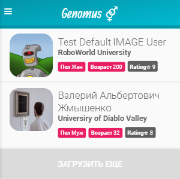

Warning: when registering a genide, it must be six-digit and contain only numbers!

This application will allow you to determine the presence of similarities with your partner and to prevent unwanted mutations in the offspring with you.
The application contains three models. Model user registered in the application. Gene model created by the administrator in the admin panel. Model of the questionnaire that the user creates for himself. The user can allow and prohibit displaying his profile on the main page, as well as prohibit comparing his genes to other users.
The admin panel allows you to delete, create and register any model object.
On the profile page, a person can find out about the result of their testing.

The application uses:
- QR scan
- when the image is missing, the robot image is loaded
- routing
- tokinization, salt

 
Source: <a href="https://github.com/Barklim/Genomus"><i class="large github icon"></i>Genomus</a>
