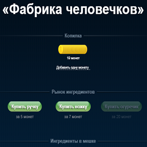

Description:
Here is the page layout of the Factory of Men.

The essence is this: the user has coins for which he can buy parts for the production of a little man (pen, leg, cucumber). Ingredients are accumulated in the bag, from which the parts are taken for production.

Now about each block in more detail.

Piggy bank.
In the piggy bank are coins. The number of coins is displayed in coins and text. Both are centered. When you click on the link “Add one coin”, another yellow coin is added to the block with coins, while the new number of coins is centered. In the text block, the number also changes, taking into account the cases (coin, coins, coins). Maximum can be 100 coins.

Market Ingredients.
The middle button is centered, the buttons on the left and right are separated by an equal distance from it. The price under the button is centered relative to the button. When buying an ingredient, the specified number of coins is subtracted from the piggy bank, and the amount of this ingredient in the bag increases. If there is not enough money in the bank to buy some ingredient, the purchase button is inactive.

Ingredients in bag.
The block with the number of legs is centered, the blocks with the number of handles and cucumbers on the left and right are also separated from it at an equal distance. Buttons are arranged similarly a little lower. When selling an ingredient, one ingredient disappears from the bag, and the specified number of coins is added to the piggy bank. If some ingredient is not in the bag, its quantity is written in a different color, and the sale button is inactive.

Production man.
Here you can choose the floor and color, add the ingredients you need for production to the boiler and create a little man. When you change the floor, the silhouette of the man changes to the corresponding floor. Add an ingredient to the boiler by clicking on the silhouette of the corresponding ingredient, while from the silhouette it turns into the corresponding picture. If any ingredient is not in the bag, its silhouette is displayed in a different color and you cannot click on it. You can also put the ingredient back into the bag by clicking on it. When all the ingredients are added, the “Create little man” button becomes active (unless of course there is the amount needed to create the wallet).

Above the boiler there is a pop-up window that always tells you why you cannot create a human being at the moment. When nothing is added to the cauldron, the window will indicate “There are not enough hands, legs and cucumber”. If at the same time in the wallet will be an amount less than the price for the creation of a little man, the window will inform you that "There are not enough hands, legs, cucumber and money." The preposition "and" is mandatory for all cases where it can be used. Each ingredient in the message can be both plural and singular. If all the ingredients are added, but the necessary amount is not in the wallet, the window will say that “Not enough money”, and so on.

We would not like the finished results of the task to appear on the network, so we urge you not to share the result in publicly available sources.

Source: <a href="https://github.com/jogarces/ics-313-text-game"><i class="large github icon "></i>jogarces/ics-313-text-game</a>

