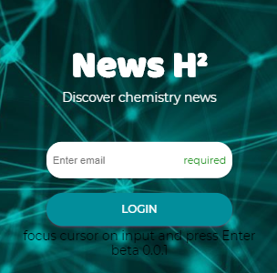

Chem-news is a web application that I helped create in Spring 2018. The project helped me learn how to design and implement a responsive web site.

Vacay is implemented using a JavaScript application platform. Within two weeks, we created a website that implements several types of reservations including flights, hotels, and car rentals.

In this project I gained experience with full-stack web application design and associated technologies, including MongoDB for database storage, the Twitter Bootstrap CSS Framework for the user interface, and Javascript for both client and server-side programming.

Source: <a href="https://github.com/Barklim/chemNews"><i class="large github icon "></i>ChemNews_H2</a>
