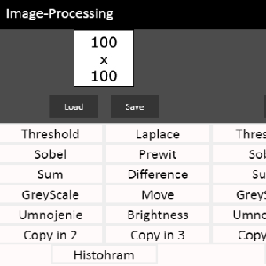

Img-Pocessing App can use basic operations!

The application have:
  - Open Image
  - Choose
  - Laplace + Prewit + Threshold (100px)
  - Sum, Difference
  - Greyscale
  - Move
  - Brightness

Source: <a href="https://github.com/Barklim/Electron-img-processing"><i class="large github icon "></i>ImgProcessing</a>
