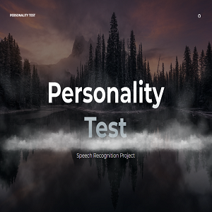

It's a simple web app that recognizes speech and gives a response with his/her personality. It's built with React.js, Watson's speech recognizing api and Indico's personality analyzing api.

Built With
React.js - The official React.js website
Watson Speech Recognition API - It's IBM Watson's website
Indico Personality Analyzing API - It's Indico's website

Source: <a href="https://github.com/Barklim/rori/blob/master/README.md"><i class="large github icon "></i>VoiceRecogintion</a>

App: <a href="https://barklim.github.io/rori/"><i class="large globe icon"></i>VoiceRecogintion</a>
