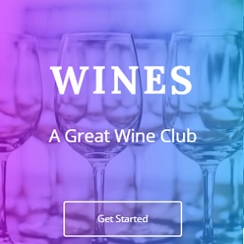

It is a startup landing page. This web page introduces a wine club company which has their own recommendation engine. Most of the parts were built with HTML and CSS.

Source: <a href="https://github.com/Barklim/wines"><i class="large github icon "></i>Wines</a>

App: <a href="https://barklim.github.io/wines/"><i class="large globe icon"></i>Wines</a>
